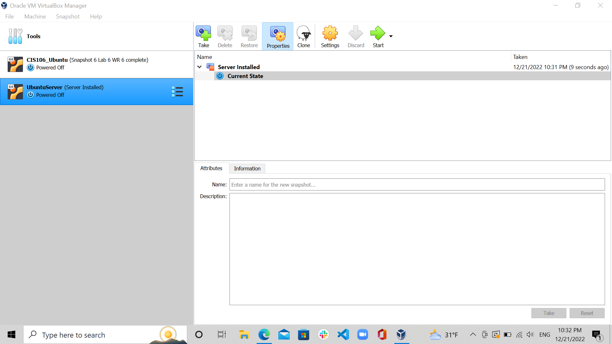
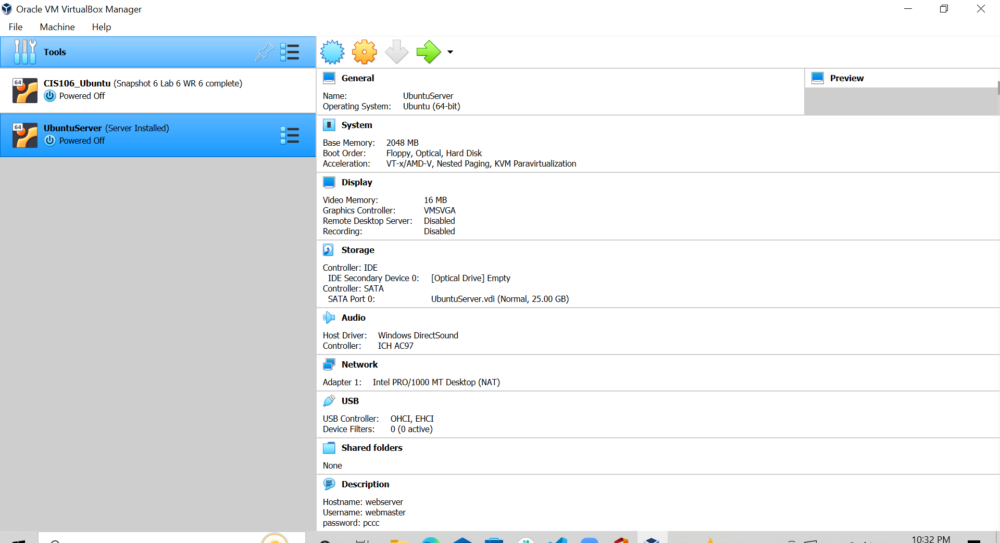
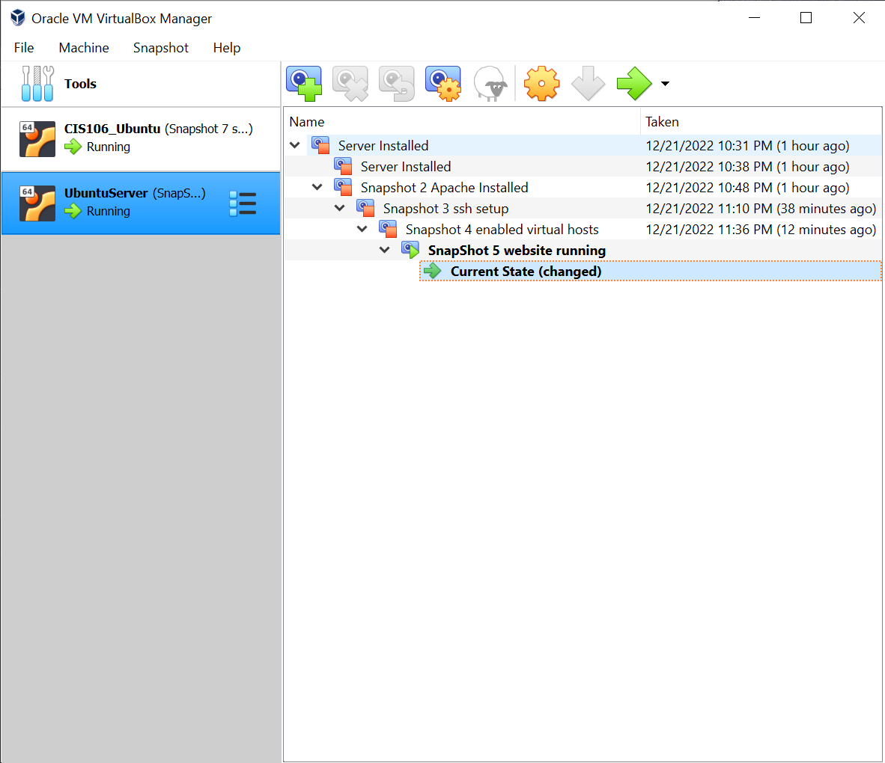
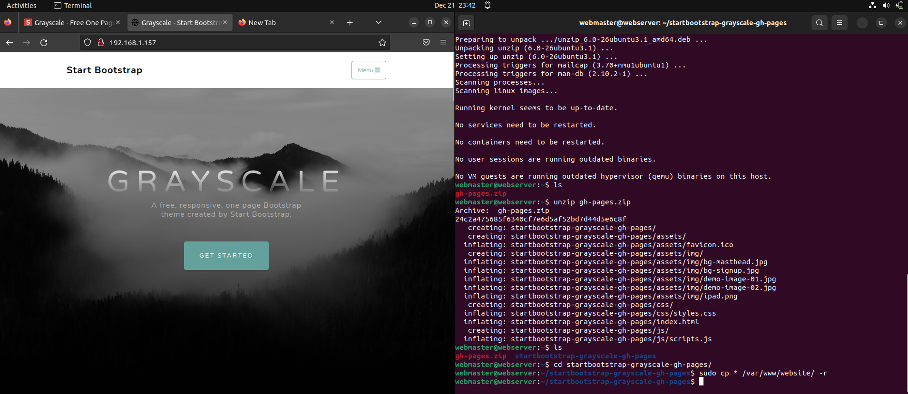

# Deliverable 1

> Tutorial can be found [here](https://www.digitalocean.com/community/tutorials/how-to-install-the-apache-web-server-on-ubuntu-22-04)

## Concepts I do not understand:

- **Apache** is a web-server that allows you to run a website. Apache web servers are free and open source.
- **SSL** stands for Secure Sockets Layer and is a protocol for establishing secure links between networked computers.
- **Virtual** Hosting is a method for hosting multiple domain names on a single server. 
- **Directives** are an official or authoritative instruction
- **Configuration Block** is a script-like piece of text, containing parameter assignments and configuration statements. 

## What is a web server?
The term **web server** can refer hardware, software, or both hardware and software working together.
### Web Server Hardware
Web server hardware refers to a computer that stores web server software and website's component files (for example, HTML documents, images, CSS stylesheets, and JavaScript files.) A physical web server connects to the internet and supports physical data interchange with other devices connected to the web.
### Web Server Software
Web server software has several parts that control how web users access hosted files. For example, HTTP is server software that understands URLs (website addresses) and HTTP (the protocol your browser uses to view webpages). An HTTP server can be accessed through the domain names of the websites it stores, and it delivers the content of these hosted websites to end user's devices. 

## What are some different web server applications?
- **Apache HTTP Server** is available on all platforms and has tons of functionality offered through a large collection of modules. 
- **MonkeyServer** is available on Linux mainly but is also supported on MacOS. It also works perfectly on Android, Raspberry Pi, and other embedded platforms. 
- **Caddy** is HTTP enabled by default and HTTP/2 get primary focus. Embeddable meaning it can be used as a library in other programs. 

## What is virtualization? 
**Virtualization** is replication of hardware to simulate a virtual machine inside a physical machine.
### Two Types of Virtualization
**Server-side virtualization** software that serves up virtual machines to users. Users need to have either a thick client, thin client, or zero client. 
**Client-side virtualization** software installed on a computer to manage virtual machines. Each VM has its own operating system installed. For client side virtualization, the computer needs a hypervisor (software that allows the management of virtual machines) and hardware support (capable CPU, RAM, and storage).

## What is virtualbox?
**VirtualBox** is a powerful type 2 virtualization product for enterprise as well as home use. It can run on Windows, Linux, Macintosh, and Solaris. 

## What is a virtual machine?
A **virtual machine** is an environment that functions as a computer system with its own CPU, memory, network interface, and storage, created on a physical hardware system. A hypervisor is needed in order to separate the VM resources from the hardware and then provisions them appropriately. 

## What is Ubuntu Server?
**Ubuntu Server** is a larger set of Ubuntu products and operating system that are used to facilitate installation on servers. Ubuntu tools are open source software, and are alternatives to various licensed products. Ubuntu Server replaces the graphical user interface with a character-based interface for installation that can be customized by the user. It is compatible with many different platforms like Microsoft Hyper-V and VMware ESX server. It can also be used ro setup a simple home network. 

## What is a firewall?
a **firewall** is a network security device that monitors network traffic and decides whether to allow or block specific traffic based on a set of security rules. Firewalls have been used in network security for over 25 years. They can be used as a barrier between secure and unsecure networks, such as the internet. 

## What is SSH?
**SSH (Secure Shell/Secure Socket Shell)** was created to replace insecure login program with a secure program. SSH supports and secures file transfer, remote device management control, tunneling, and forwarding TCP ports and X11 connections. 

# Deliverable 2

