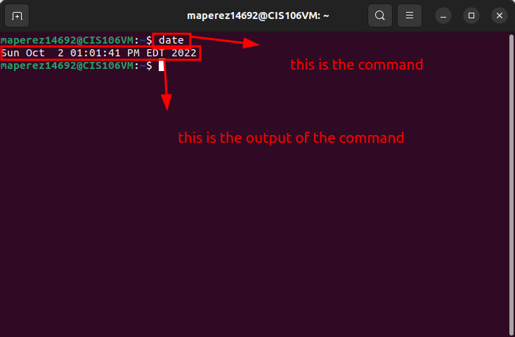
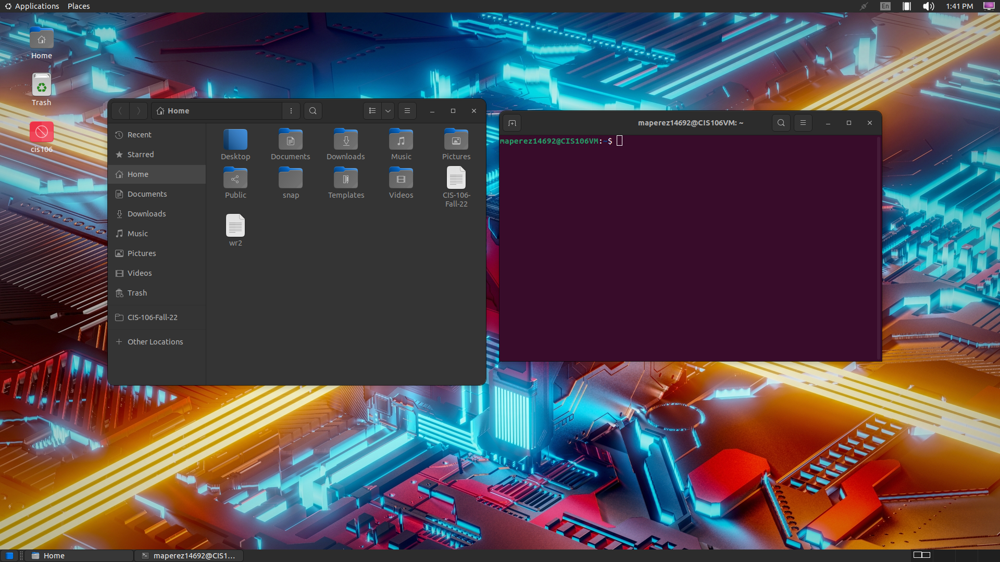

# Lab 3 Submission

## Question 1

no submission

## Question 2

## Question 3

| Program purpose     | Package Name     | Version                                  |
| ------------------- | ---------------- | ---------------------------------------- |
| Play a tetris game  | blockattack      | 2.7.0-1 amd64                            |
| Play a video file   | dragonplayer     | 4:21.12.3-0ubuntu1 amd64                 |
| Browse the internet | epiphany-browser | 42.4-0ubuntu amd64                       |
| Read your email     | geary            | 40.0-2 amd64                             |
| Play music          | clementine       | 1.4.0~rc1+git347-gfc4cb6fc7+dfsg-2 amd64 |

Which command did you use to install?
sudo apt install blockattack dragonplayer epiphany-browser geary clementine -y

Which command did you use to remove?
sudo apt remove blockattack dragonplayer epiphany-browser geary clementine -y

Which command did you use to install and remove?
sudo apt install blockattack+ dragonplayer- epiphany- browser- geary- clementine+ 

## Question 4 

| command | what it does                                                   |
| ------- | -------------------------------------------------------------- |
| echo    | display line of text                                           |
| fortune | print random hopefully interesting adage                       |
| cowsay  | configurable speaking/thinking cow                             |
| lolcat  | rainbow coloring effect for text console display               |
| figlet  | display large characters made up of ordinary screen characters |
| toilet  | display large colorful characters                              |
| rig     | random identity generator                                      |