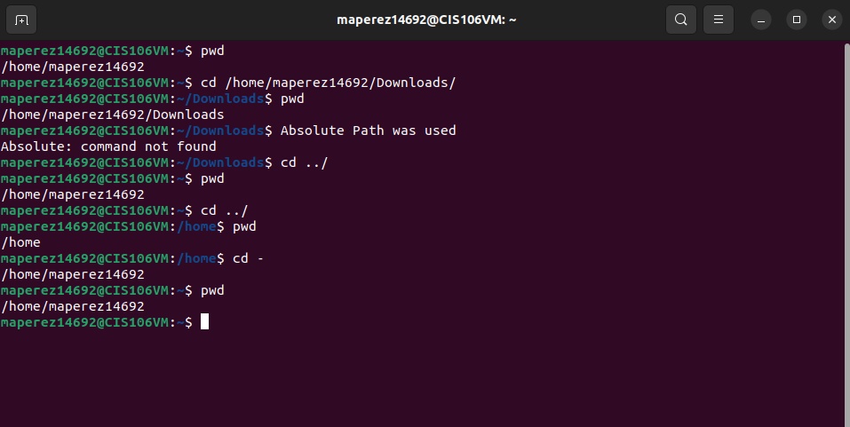
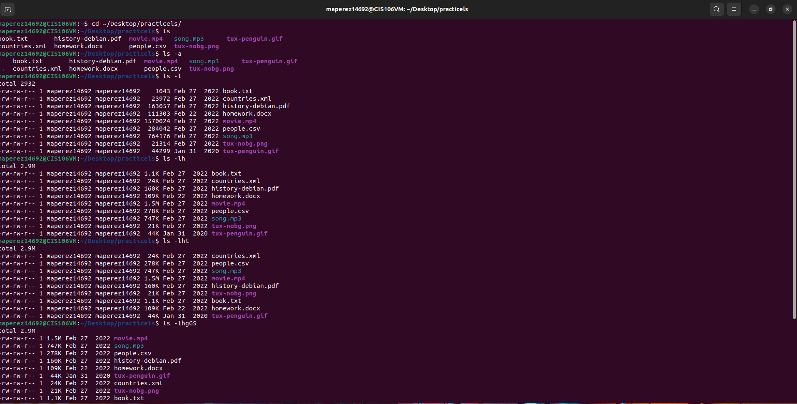
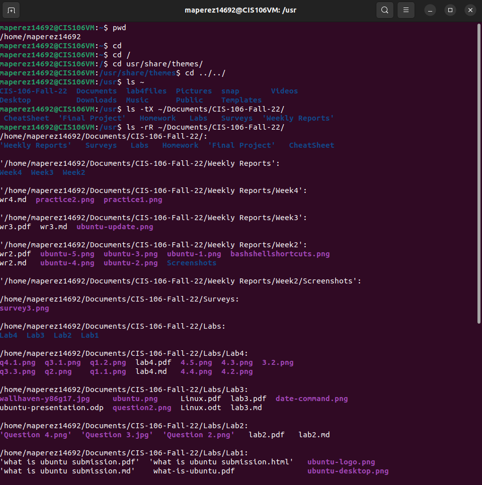

# Week Report 4

## Practice
Practice 1

Practice 2

Practice 3

## The FileSystem (some important directories)

| Directory | Data Stored in Directory                                                                                                                      |
| --------- | --------------------------------------------------------------------------------------------------------------------------------------------- |
| bin       | essential commands                                                                                                                            |
| dev       | device files                                                                                                                                  |
| etc       | system configuration files                                                                                                                    |
| home      | user home directories                                                                                                                         |
| media     | mount point for removable media, such as DVDs and floppy disks                                                                                |
| opt       | add on software packages                                                                                                                      |
| proc      | kernel information, process control, system hardware information                                                                              |
| srv       | information relating to services that run on the system                                                                                       |
| usr       | software not essential for system operation, such as applications                                                                             |
| var       | dedicated to variable data, such as logs, databases, websites, and temporary spool (emails etc.) files that persist from one boot to the next |

## Commands to navigate the file system

| Command | What it does                                               | Syntax | Example        |
| ------- | ---------------------------------------------------------- | ------ | -------------- |
| pwd     | prints current working directory                           | "pwd"  | pwd            |
| cd      | used for changing current working directory                | "cd"   | cd ~/          |
| ls      | used for displaying all the files in the current directory | "ls"   | ls ~/Downloads |

## Key terms

**Definitions of the following terms**
*File System* the way files are stored and organized to simplify access to data 
*Current Directory* the directory where you are at the moment 
*Parent Directory* a directory containing the current directory 
*Subdirectory* a directory under the parent directory 
*Home Directory* the directory where all the users are listed 
*Your Home Directory* the directory that is in your user profile under THE home directory 
*Pathname* the location of the file in the filesystem (like an address) 
*Absolute Path* the location of a file starting at the root of the file system
*Relative Path* the location of a file starting from the current working directory or a directory tht is located inside the current working directory. 

**Commands for navigating the file system**
- pwd
- cd
- ls

