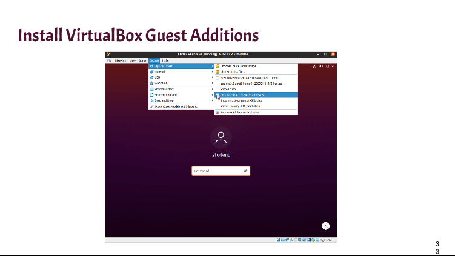
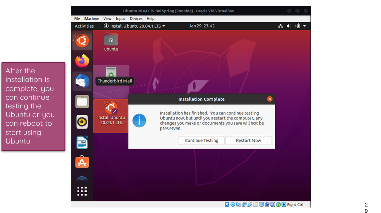
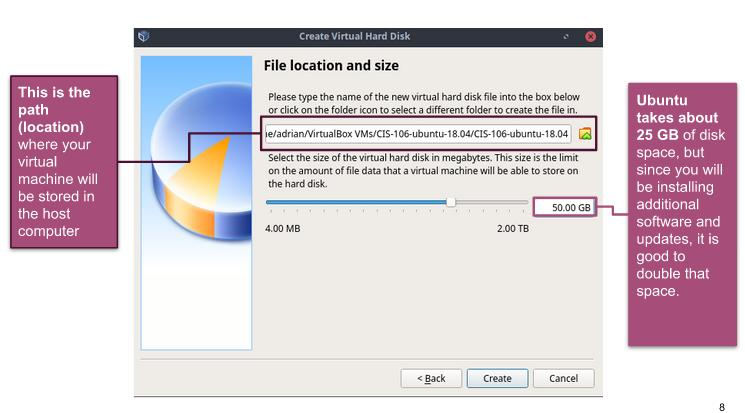
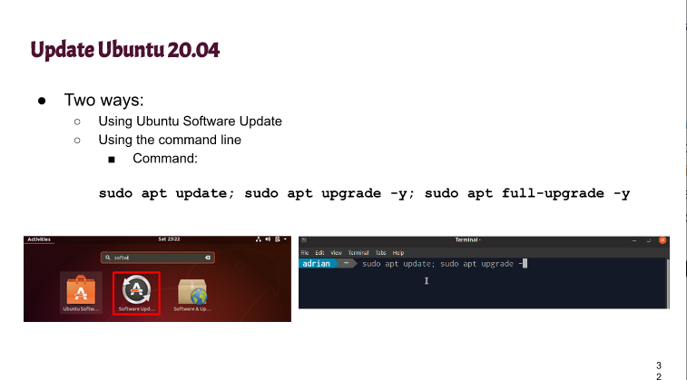
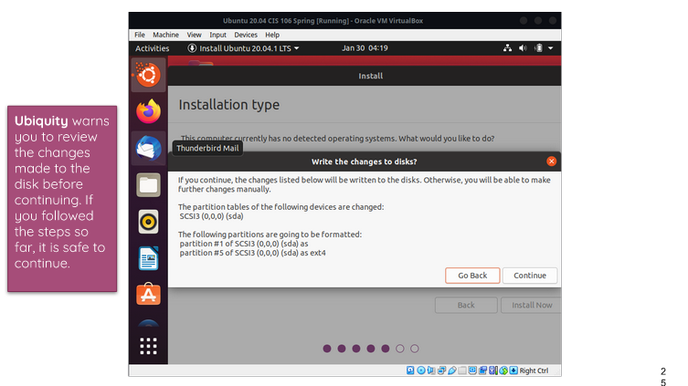

# Week Report 2

## The basics of virtualization

**What is virtualization?** 

Virtualization is when there is replication of hardware to simulate a virtual machine inside of a physical machine. 

**Types of Virtualization**
1. Server side virtualization software provides virtual machines for others to use. The virtual machines provided can be used with equipment such as thick client, thin client, or zero client. 
 
2. Client side virtualization is software installed directly onto a computer to manage virtual machines. The virtual machine has must have its own operating system installed. For client side virtualization to function the computer needs a hypervisor and hardware support. 

## Installing Ubuntu

