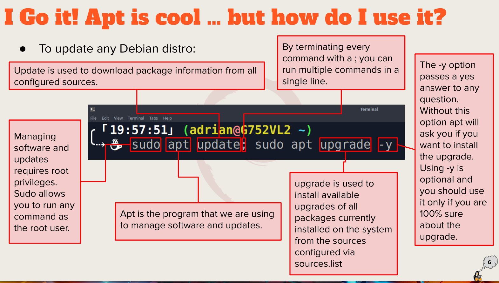

# Summary of Presentations

## Exploring Desktop Environments

1. Desktop Environments
- GNOME
- MATE
- BUDGIE
- Cinnamon 

2. Definitions
- GUI (graphical user interface)-a set of programs that allows a user to interact with the computer system via icons, windows, and various other visual elements. 
- DE (desktop environment)-bundle of programs running on top of a computer operating system, which shares a common GUI, sometimes described as a graphical shell.  

1. List of Common Elements of a Desktop Environment 
- Icons
- Launcher
- Favorites Bar
- Files Manager
- Widgets

## The Bash Shell

1. What is a shell?
- The shell is the layer of programming that understands and executes the commands a user enters. 
   
2. List different shells
- Tcsh Shell
- Csh Shell
- Ksh Shell
- Zsh Shell
- Fish Shell

3. List bash shortcuts 
- Ctrl + A 
- Ctrl + E
- Ctrl + K
- Ctrl + U
- Ctrl + W
- Ctrl + Y
- Ctrl + XX

4. List basic commands and their usage
- date (displays the current time and date)
- cal (displays a calendar of the current month)
- df (displays the current amount of free space on our disk drives)
- free (displays the amount of free memory)
- uname (displays the information about your system)
- clear (clears the screen)
  
## Managing Software 

1. Command for updating ubuntu 
sudo apt update; sudo apt upgrade -y

2. Command for installing software
sudo apt install package name
  
3. Command for removing software
sudo apt remove package name
  
4. Command for searching for software
apt search "web browser"
  
5. Definition of the following terms
- Package-archives that contain binaries of software, configuration files, and information about dependencies.
- Library-reusable code that can be used by more than one function or program. 
- Repository-a large collection of software available for download. 
  

