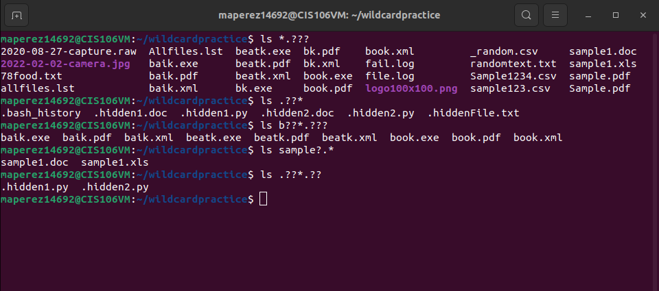

# Week Report 6
## Wild Cards
### Wild Card *
An asterisk/star alone matches anything and nothing and matches any number of characters.
Examples of when to use the * wildcard
When you want to list all files with a particular file extension.
When you do not remember the complete name of a file but you remember a portion of the name.
When you want to copy, move, or remove all files that match a particular naming convention. 
**Examples**
ls *.txt lists all file that end in .txt
ls *.txt *.pdf list all the files that end in .txt and .pdf
ls file.* lists all the files with the string "file" regardless of their file extension. 

### Wild Card ?
The question mark wildcard matches precisely one character.
The question mark wildcard proves very useful when working with hidden files. 
**Examples**
ls ./.??* lists all the hidden files in the current directory
ls ../.??* list all the files in the parent directory
ls *.??? list all the files that have a 3 letter file extension 

### Wild Card []
The brackets wildcard match a single character in a range. 
The brackets wildcard use the exclamation mark to reverse the match. For example, match everything except vowels [!aeiou] or any character except numbers [!0-9]
**Examples**
ls [a-psc]* match all files whose name begins with a letter a-p or start with letters s or c
ls [a-fp-z]* match all files whose name begins with any of those two sets of characters: letters from a-f or p-z
ls f[aeiou]* match all files that have a vowel after letter f 
## Practice Questions

### Practice 1

### Practice 2

### Practice 3

## Brace Expansion
Brace expansion {} is not a wildcard but another feature of bash that allows you to generate arbitrary strings to use with commands.
**Examples**
To create a whole directory structure in a single command
mkdir -p music/jazz{jazz,rock}/{mp3files,videos,oggfiles}/new{1..3} 
To create a N number of files use:
touch website{1..5}.html
touch file{A..Z}.txt
touch file{001..10}.py
touch file{{a..z},{0..10}}.js
Remove multiple files in single directory 
rm -r {dir1,dir2,dir3,file.txt,file.py}
